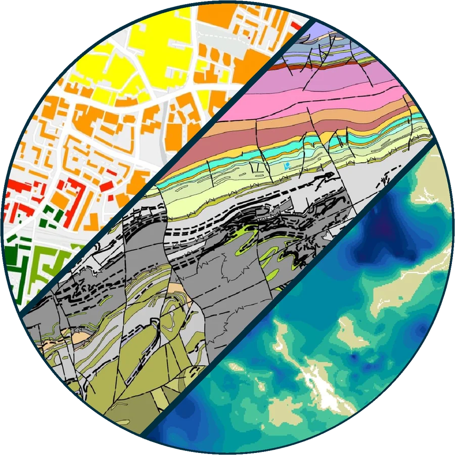

<h1 class="bgs-sr">BGS data products and APIs</h1>

  

  

British Geological Survey

Data products &amp; APIs

BGS licenses a portfolio of national geoscience datasets and publishes a selection of open data through standards-based APIs. This site brings together the product information, user guides and API documentation in one place.

<a class="bgs-tile" href="products/"><strong>Products</strong>The 2026–27 product portfolio: overview, key features, licencing and user guides for each dataset.</a>
<a class="bgs-tile" href="apis/"><strong>APIs</strong>OGC API – Features, Web Map Services and SensorThings: endpoints, query syntax and examples.</a>
<a class="bgs-tile" href="examples/"><strong>Examples</strong>Jupyter notebooks showing how to query BGS APIs from Python.</a>

